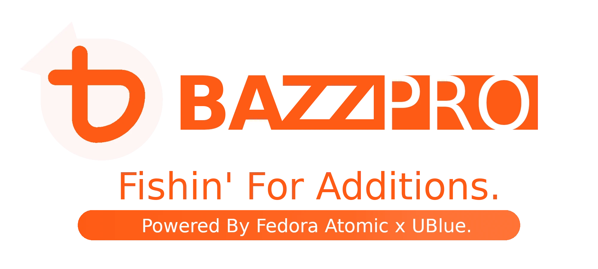

  

> [!NOTE]  
> This project is intended for [megalisp's](https://github.com/megalisp) "Daily Driver" machines; 
> Carefully consider if you actually want to use this compared to   making your own image -- [which is honestly pretty easy](https://github.com/ublue-os/image-template?tab=readme-ov-file#how-to-use). 

 

> This image is sort of a "developer experience" or dx image plus some other low-hanging, useful additions on-top of [Bazzite](https://bazzite.gg). 

#### Right now we ship:
- Racket
- VSCode
- Gh-cli, git-lfs
- Syncthing
- Rclone
- Restic

##### Next up
- Restructure so we have a `desk` and `deck` image.
  - Both need to have a dx (developer experience) version.
